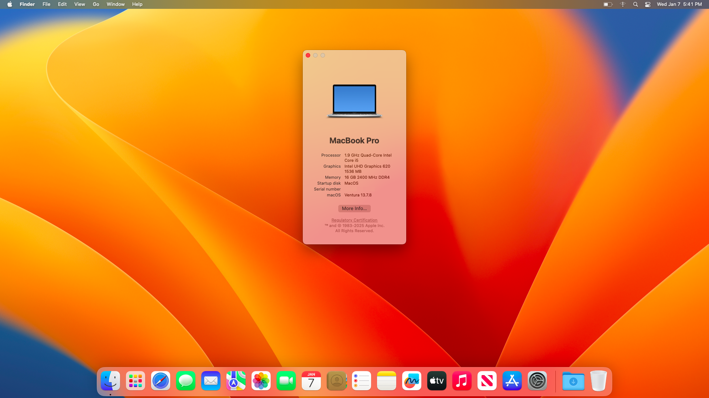

# Dell Latitude 7390 EFI - macOS Ventura

Dell Latitude 7390 OpenCore EFI build for macOS Ventura v13.7.8. It also works wih macOS BigSur.

## Screenshot

<figure>

<figcaption>Screenshot of the macOS Ventura Desktop</figcaption>
</figure>

## Specification

| Device            | Model                               | Status   |
| ----------------- | ----------------------------------- | -------- |
| CPU               | Intel Core i5-8350U                 | Works    |
| GPU               | Intel UHD Graphics 620              | Works    |
| Memory            | SK hynix 16GB DDR4 2400 MHz         | Works    |
| Drive             | Micron 1300 500GB SATA III          | Works    |
| Audio             | Realtek ALC3246                     | Works    |
| WiFi & BT         | Intel Wireless-AC 8265NGW           | Partial  |
| Ethernet          | Intel Ethernet I219-LM              | Works    |
| SD Card Reader    | Realtek Memory Card Reader          | Works    |
| Smart Card Reader | Broadcom USH 5880                   | Untested |
| Mic               | Builtin                             | Works    |
| Webcam            | Builtin                             | Works    |

# <h2>What Works?</h2>
Pretty much everything holding the fact that you have the same specification on your laptop. Following item were tested in working order.
<ul>
  <li>GPU Support</li>
  <li>Sound Card</li>
  <li>Microphone</li>
  <li>Webcam</li>
  <li>USB Ports</li>
  <li>Trackpad</li>
  <li>Ethernet</li>
  <li>WiFi</li>
  <li>Keyboard Backlight</li>
</ul>
Please bare in mind that I didn't get the chance to test out the HDMI and SD Card Reader. Natively Mac OS supported WiFi modules should work out of the box but if you are using Intel based Card with different model number, please feel free to check out the <a href="https://github.com/OpenIntelWireless/itlwm/">OpenIntelWireless</a> repository for appropriate KEXT. You must use the <a href="https://openintelwireless.github.io/HeliPort/">HeliPort</a> app to connect to your network. Ethernet works without any issue.

# <h2>Important Note</h2>
<ul>
  <li>You must update your SMBIOS info and generate your own MLB, SystemSerialNumber and SystemUUID. Please DO NOT use mine.</li>
  <li>I made lots of changes on Boot options section. So, please use <a href="https://github.com/ic005k/OCAuxiliaryTools">OC Auxiliary Tools</a> to re-adjust those changes as per Dortania's instruction mentioned <a href="https://dortania.github.io/OpenCore-Install-Guide/config-laptop.plist/kaby-lake.html#misc">here</a>.</li>
  <li>I won't be providing any support with this EFI at this point as this was a hobby project and I am done with it for the most of the part.</li>
</ul>

Thank you for stopping by.
